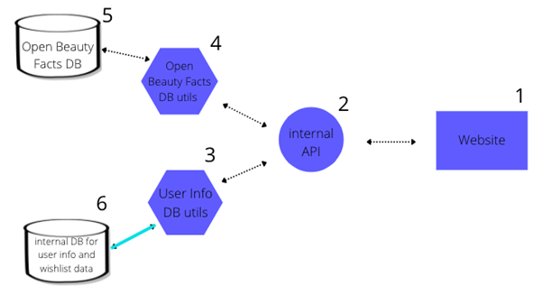

# CFG Nanodegree Software Project — Group 2
## 🌸 Cosmo: Cosmetics Search Engine by Ingredient
## Homework Week 2 

This week’s homework will be purely Project based. You need to work as a group and the homework will be submitted by one of the members of your group. List the other members of your group in the document, so that your instructor can mark every student. 

### Members of the group:
- Chizulum Nwizu
- Claire Boitet
- Georgia Woolley
- Nasian Ahmed
- Nikita Patel
- Sophie Gilbert

### 1. Your group needs to decide what kind of project you are going to work on and lock in your decision. 

### 2. You need to submit a free style paper that describes your project on a high level. Please cover the following questions: 

### 1. What are you building? 
Our project, Cosmo, is a search engine web application which falls in the industries of beauty and cosmetics and will provide users with the ability to search for product ingredients. It makes primary use of API’s and databases (DBs), and is written using Python, SQL, html, css and javascript languages. 
It has multiple components to function: 
- an external SQL DB containing product information
- an internal SQL DB containing user info and wishlist data
- two separate db_utils files for both the product DB and the internal DB,
- an API that connects these with the web application user interface (UI). 

### A breakdown of each component is given below:

#### 1. Website/User interface
The page will be created with html, css and javascript and will consist of a home page, account page, results display page, wishlist page, login page and sign up page.

#### 2. Internal API 
This Flask RESTful API contains endpoints that allow the transfer of information between the Cosmo - Open Beauty Facts Products DB, the User Info and Wish List DB and the website UI with which the user interacts. 
A few of the operations will include but are not limited to: 

- Transfer new wishlist data from the website to the wishlist table in the User Info DB 
- Send all the wishlist data from the wishlist Table to the website whenever the user wants to view them on the wishlist page 
- Take the users ingredient inputs and send it to the backend so it can be used to query the Open Beauty Facts DB 
- Get the results from this query and send it to the webpage to be displayed in the results display page 

The API is primarily responsible for creating the routes or the http pipeline for this data exchange and the bulk of the operations listed above is handled by the DB_utils files we will discuss below.

#### 3. User Info & Wish List DB_Utils 
This file will contain functions responsible for querying the database and handling db connection errors if they occur. Some of these functions will insert user info into the user info table and retrieve it whenever the user logs in, other functions will either insert or retrieve wishlist data and are used depending on the nature of the API request. 

#### 4. Cosmo - OBF Products DB_Utils 
This file will contain functions responsible for querying the DB. Some of these functions will get the productIDs corresponding to the ingredients the user requested and fetch the product info linked to those ID’s. This search could either be done in an ordered way where ingredients must be in a fixed position in the ingredient list or in an unordered way. Another function to include would be one searching for products that do not contain a particular ingredient or set of ingredients.

#### 5. Cosmo - OBF Products DB 
This DB consists of 2 tables: 
- one for Products 
- one for the Ingredients you would find in those products, ordered by position.

We fetch data using an homemade API from a modified SQL copy of the Open Beauty Facts (OBF) CSV Products database, which is a subproject from Open Food Facts (OFF). We chose this option because the OBF API was experimental and unusable as is for our purpose, since it only allowed searching for a product by barcode. Besides, we do not know its structure at all because its documentation is almost nonexistent.
The database is constructed from the OBF CSV file and required cleaning, as the CSV file  was unfinished and formatted badly. This involved formatting the ingredients columns and deleting empty columns, duplicate rows and rows with empty ingredient lists. 

#### 6. Internal DB for User Info and Wishlist Data 
This DB consists of 2 tables:
- one for User Info
- one for Wishlist Info

The Users Info DB stores information that has been taken from the user such as their name and email address. The Wish List DB stores products found through our cosmetic search engine and that the user would like to come back to. The Wish List stores data for a particular user retrieved using the API. The Users DB is connected to the wishlist feature through a primary key. Our app is optimised for usability, with the DB being designed to save user information so they can come back to view their previous searches and wishlist. Our web pages send the information inserted into the forms by users to our DB, when they create an account.

### 2. What does it do or what kind of problem does it solve? 

The name of our project is Cosmo. It is a cosmetic products search engine which is a tool that searches by ingredient. Its purpose is to search for the closest products on the market according to their ingredient composition against a base product.
Say, a user has a favourite cosmetic product that they consider to be “virtually irreplaceable”, and this product gets discontinued or they are unable to access it due to various reasons,  e.g. their local drugstore is not offering this product anymore.This is a terrible situation to be in for the user! Our project solves this issue by providing a means for the user to find an alternative cosmetic product that is as similar as possible by chemical composition as the user’s original product. 

Finding good cosmetics can be difficult: marketing often makes misleading and wild claims about their efficacy regardless of their actual composition, as if they were some sort of magic potions. In the end, cosmetics are recipes made of specific molecules with a biological effect, so the informed user should be able to make a choice based on this objective criteria. Given the host of choice we are given on the market, however, this apparently simple task can prove nigh impossible. One cannot realistically browse the entire web, systematically comb every shop shelf and read every single product label… This is where data comes into play at our rescue. 

When you read the label at the back of a product, the order of the ingredients does matter as it reflects their relative concentrations: the 1st one has the highest concentration, and the last one the lowest. Some cosmetic-related tools and search engines such as OBF or INCIDecoder already exist, but so far they only offer a list of products containing or not a specific ingredient, regardless of their position within the list. 
Cosmo is an app that not only returns a list of products containing a particular ingredient, but also takes into account its position in the ingredient list. Moreover, it allows you to search for products without a specific ingredient, and to perform a multi-criteria search up to the 5th ingredient. 

#### User Stories to be completed in priority:
- I have [acne prone skin], I need to find products with [salicylic acid] in it.
- As [an allergic person], I need to be able to search for products without [parabens] in it so I don’t die from a bad rash.
- I would prefer to avoid products with [alcohol/ethanol], or only show those with a low percentage of it
- I am a forgetful person, I want to keep products I select to be saved in my wishlist so I don’t lose them.
- I am a skincare junkie and a cosmetics nerd, I want to get any product with [ingredients X,Y and Z] but without [ingredient U].
- I want a product containing X as 1st or 2nd ingredient but not Y due to the user being allergic to Y.

Finally, there are features that we would like to add later but that we will probably not be able to implement during this nanodegree. 
For example, we would like to be able to give links to shops selling a product, avoid or favour products made or sold in a particular country, or search only for vegan products for example. All of this information does exist in the OBF DB but is not really easy to retrieve yet, because their API is still very experimental.
Another interesting but more complex option could be to find products having the closest composition to another one, which would require calculating similarity scores between products (NLP cosine similarity?).

#### User Stories to be completed later:
- As a fanatic of [product W] which has been discontinued, I want to find [something as close as possible ingredient-wise], so I can resume my normal hair routine ASAP.
- I am someone looking for a one stop shop for cosmetics, I would like to know where to purchase the products I select. 
- I live in [London], I would like to filter my searches so I only get results from [UK] stores. 
- I want to avoid products sold in a certain country e.g. [China] (as you have to test on animals to sell products in China).
- I am only looking for [vegan] products.

### 3. What are the key features of your system? 

#### 1. Home page/ Search Tool
As the system is designed around searching for ingredients that already exist, one of its key features is the search tool. Shows input fields for up to 5 ingredients. 
Can search for ingredients to be done in the unspecified order:
We designed this tool to search a database that lists all the specific ingredients in beauty products and return results where specified ingredients appear. 
We also designed the opposite feature, so the search results in only products without certain ingredients. For example, if a searcher was allergic to ingredient x, all products containing ingredient x would be removed from all of their search results. 

Or in the specified order: Another feature of the search tool is the ability to search for an ingredient in a specific position on a product’s ingredient list. Generally, in beauty products, ingredients are listed in order of what has been used most, so our tool enables searchers to look for ingredients with a larger percentage of each ingredient. 

#### 2. Account page  
Shows the users information such as username, email address etc.

#### 3. Results display page 
This is where the users search results will be displayed according to the ingredients they put in on the home page. 

#### 4. Wishlist page 
Another important component of the system is a wishlist which enables users to save products from their search results. When a user likes a particular product from the search results page, they have the option to add it to the wishlist. Any product added to the wishlist will be stored and displayed on the wishlist page. This relies on the creation of an account which would store all products specified by the user. Each wishlist is unique to the user, and stores only the products they have selected from their own search results. 

#### #5. Login and Sign up page 
New users can sign up for an account and old users can just log into their previously created account at any time. 

### 4. Provide a sample architecture diagram of your system (you can use PPT with squares and circles to demonstrate a simplified flow of your system)

High Level Design for our Cosmo App: 

### 5. Describe the team approach to the project work: how are you planning to distribute the workload, how are you managing your code, how are you planning to test your system.

#### Distribution
The workload was distributed based on the sections people wanted to work on and what each individual wanted to improve on while coding. This was based on the tasks we had created amongst ourselves: 
- Front End Web Page - Chizu, Georgia & Nikita
- Backend Users & Wishlist API - Nikita, Sophie
- Backend Products API - Claire, Chizu
- Users & Wishlist DB - Nasian, Georgia, Nikita 
- OBF_Cosmo_Products DB - Chizu, Claire (not using OBF DB directly)
- Users DB_Utils & Config - Nasian, Georgia, Nikita
- Wishlist DB_Utils & Config - Nikita, Nasian
- Products DB_Utils & Config - Claire
- Tests - Nasian, Sophie, Nikita
- Backend Main (mock Front End for tests) - Georgia, Sophie

Claire also set-up a ClickUp for our group to help us organise our tasks and every task that each individual is working on is demonstrated there. 

## 
#### Managing our code
- We are managing our code through GitHub, where we have split our GitHub into branches for each person to work within, so once a script is completed it will all be pushed to the GitHub for others to see.
- We review each other's code in subgroups, which are split based on tasks.
- Before we push our code to GitHub, we ensure our code is consistent within the sub-groups we’re working in.
- Through our daily scrum meeting, we update each other on what we’ve worked on or added to the GitHub, we will check our code works as intended and review it or clean up the code when necessary. 
- We have longer meetings on Sundays in which we review the work we have done and discuss what we completed within the week and what there is left to complete or do for the week which is coming up. This is also a chance to come together and ensure our code is consistent with each other.

#### Testing the system 
We intend to test the system using unit testing for various aspects of our code and system. 

#### For example we want to test:
- The creation of a new user account in which the user will input their name, email and password - to make sure this information is both updated to the sql database and actually creates an account for the user to login to.
- We want to test our data and ensure we can get information associated with a specific user through their user ID/ name - one way would be to have a Test case ID to ensure all users have a unique ID to represent them 
- We want to test the searching facility to make sure ingredients are found in the correct order. 
- We also expect to test the ability of our system to retrieve and display items with a specific ingredient defined by the user.
- We want to test the wishlist feature to make sure all items on the wish-list are displayed on the wishlist page, with a dictionary containing product information. This test would also need to show that the items a user saves in their wishlist basket is also updated to a SQL database so that the user is able to retrieve their saved wishlist items at a later date.
