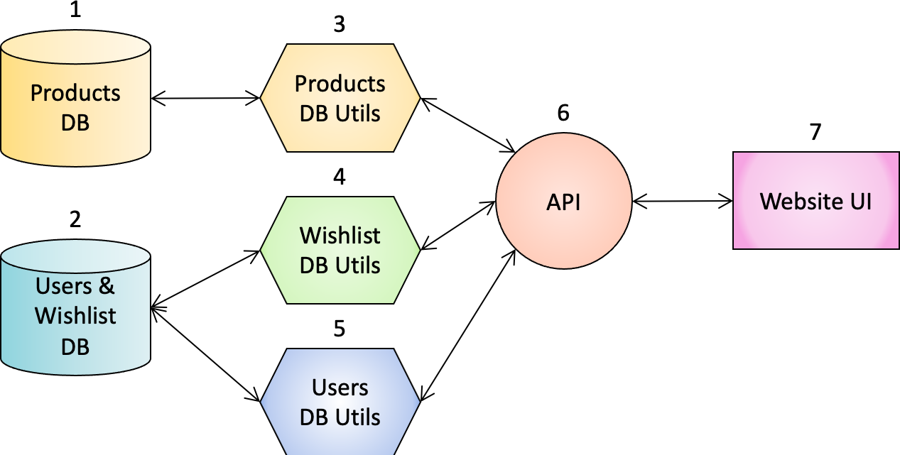

# 
Project Work Document – Group 2  <small>Cosmo – Cosmetics Search engine by Ingredients</small>

<!-- Below is a draft structure for your project document submission. Sections in bold font are compulsory, however you may adjust any sub-sections (remove or add) as required to make it tailored to your own work.
This document would be used to assess your project work and understand your approach to the project delivery. It will also provide an insight into your architecture, testing and implementation strategy as a team.

NOTE: Your instructors team would also use this documents as part of the mock interview assessments to support their enquiries about your work and ‘rehearse’ live-like interview scenarios.
We expect this report to be concise, but very detailed, so that every key point is explained and covered. It should be no more than 5-7 pages (A4) long. The report can and should include diagrams, images with descriptive captions.-->

## INTRODUCTION
### Aims and objectives of the project
Our project aimed at building a cosmetic search engine by ingredient: Cosmo.  
Our objectives were to allow users to: 
- sign up, create an account and log in to it (Users side) <!--arm/wing-->
- search for products meeting several ingredient-related criteria (Products side)
- save selected products to their wishlist and manage it as they want (Wishlist side)

### Roadmap of the report
xxxxxxxxxxxxxxxxxxxxxxxxxxx

## BACKGROUND
<!--Any specific details about the project based on your chosen topic. For example, if it is a game, it would be good to understand the rules of the game and its logic. If it is a trading portfolio, then explain what analysis you are performing (end of day profit/loss, historical price evaluation etc.) and how does it work. If it is a restaurant booking system, then explain the rules / requirements that your team locked in for the system.-->

Imagine looking for a replacement to your favourite conditioner which has been discontinued, a cheaper equivalent to some expensive skincare product, one excluding some ingredients to which you are allergic, or substituting them by more ethical alternatives. How would you go about it?

The world of cosmetics can be difficult to navigate: marketing often presents products as some sort of magic potions wrapped in a pretty packaging, using fancy buzzwords and making inaccurate and/or unrealistic claims about their benefits.  

In reality, cosmetics are formulas composed of specific molecules with a particular biological effect, and even though their exact recipe remains a trade secret, the order of ingredients on the label reveals important information, as it reflects their relative concentrations: the first has the highest concentration, the last one the lowest.

In theory, an informed user should thus be able to make a choice based on this objective criteria. Given the host of choice we are given on the market, however, this deceptively simple task can prove nigh impossible. One cannot realistically browse the entire web, systematically comb every shop shelf and read every single product label… This is where data comes into play at our rescue.

Some cosmetic-related tools and search engines such as Open Beauty Facts (OBF) or INCIDecoder already exist, but so far they only offer a list of products containing or not a specific ingredient, regardless of their position within the list.

Cosmo is an app that not only returns a list of products containing a particular ingredient, but also takes into account its position in the ingredient list. Moreover, it allows you to search for products without a specific ingredient, and to perform a multi-criteria search up to the 5th ingredient.

## SPECIFICATIONS AND DESIGN
### Requirements 
#### Technical requirements 
We used portable tools and languages to build our application, specifically:
- Languages: Python 3.9, SQL, javascript, html and css
- RDBMS: MySQL Workbench and DB Browser for SQLite
- IDEs: PyCharm and VSCode
- Version Control: GitHub.com and IDEs Git tools

#### Non-technical requirements
We strove to follow the Software Development Life Cycle (SDLC) framework and to implement Agile methodology. In particular, we had our Scrum Master organise Daily Scrum and weekly Sprint Planning meetings on Zoom. We also created "User Stories" to present features to implement in our product. We started by creating a very minimal core app with only a few functions, made sure that they worked, then incrementally improved our app. 

### Design and architecture
Our application comprises the following components, here ordered from the back end to the front end:
- **2 Databases**
  - Products DB
    - Products table
    - Ingredients table
    - Search table
  - Users & Wishlist DB
    - Users table
    - Wishlist table
- **3 DB Utils scripts**
  - For Products
  - For Users (OOP)
  - For Wishlists 
- **API (2-in-1)**
  - Products API
  - Users & Wishlist API
- **Website User Interface (UI)**
  - Home page/ Search Tool
  - Login and Sign up page
  - Results display page
  - Login and Sign up page
  - Wishlist page
  - Account page

#### Databases (DB)
Because we originally planned to use the remote Open Beauty Facts products DB through their API and to create our own Cosmo DB containing Users information and their Wishlists, we decided to keep the "Products" and the "Users & Wishlist" DB artificially separated. In reality, this is not absolutely necessary, and we could put them together, but we kept them apart in order to conserve our original design with an external and an internal DB. For this project, they are still run on the same local RDBMS, but ultimately we would like to host them on a remote server . 

##### 1 - Products DB (`cosmo_tables.sql` and `Products` DB)
The `Products` database, also referred to as `OBF DB`, contains cosmetic products related information and is divided into two large `products_table`and `ingredients_table` and a smaller `search_products`table.

###### Products table (`products_table`)
The product table is a cleaned up version of the database downloaded from [Open Beauty Facts](https://world.openbeautyfacts.org/data/en.openbeautyfacts.org.products.csv). This 18843 rows x 176 columns table was modified by the `clean_csv_tables.py` script using the `pandas` library and a homemade `ListDF.py` module in order to only keep products for which a proper list of ingredients was available. A unique `productID` was created for each row and only 17 columns were selected, resulting in a 7082 rows x 18 columns table. A monotonically increasing `index` field was also added because as the database was being cleaned up, some rows were deleted but the others kept the same `productID` for consistency. *(see EER diagram above)*  

###### Ingredients table (`ingredients_table`)
The `ingredients_text` column from the products table was then parsed, transformed into a list and expanded, so that for each `productID`, every single ingredient would go into a single column according to its index in the list. This step created a new 7082 rows x 119 columns table in which the first field corresponds to the productID, and the others to the index of ingredients within the ingredients list, from 0 to 117. *(see EER diagram above)*  

###### Search table (`search_table`)
This table temporarily (?) stores the results of individual product searches so that they can be retrieved and displayed on the Results web page while doing another search. *(see EER diagram above)*

##### 2 - Users & Wishlist DB (`CFG_Projet`)
###### Users information table (`Users_Info`)

###### Wishlist table (`Wish_List`)

#### DB Utils (+ credentials)
##### 3 - For products (`obf_db_utils.py` + `config.py`)

##### 4 - For users (OOP) (`db_utils_user_oop.py` + `config.py`?)

##### 5 - For wishlists (`wishlist_db_utils.py` + `wishlist_config.py`)

#### 2-in-1 API (`app.py`)
Our API 2-in-1 API offers endpoints to connect to out 2 DB
##### 6 - Products API ()

##### 7 - Users & Wishlist API ()

#### Website User Interface (UI)

##### Home page/ Search Tool

##### Login and Sign up page

##### Results display page

##### Login and Sign up page

##### Wishlist page

##### Account page

## IMPLEMENTATION AND EXECUTION
### Development approach and team member roles
We tried to give ourselves roles as in a typical Agile team, but as we all had the same experience with this methodology (that is, none), it was not really possible to rely on a senior Agile expert "Scrum Master", and the role of "Product Owner" was also difficult to implement in a self-organising "democratic" team. Therefore, the workload was distributed based on the sections on which team members wanted to work, because they enjoyed this particular part of the project or in order to improve these particular programming skills.

|                **TASKS**                |**Chizu**|**Claire**|**Georgia**|**Nasian**|**Nikita**|**Sophie**|
| :-------------------------------------- | :-----: | :------: | :-------: | :------: | :------: | :------: |
| Products DB (Cosmo-OBF)                 |    X    |     X    |           |          |          |          |
| Users & Wishlist DB                     |         |          |     X     |     X    |     X    |          |
| Products DB_Utils & Config              |    X    |     X    |           |          |          |     X    |
| Users DB_Utils & Config                 |         |          |     X     |     X    |     X    |          |
| Wishlist DB_Utils & Config              |         |          |           |     X    |     X    |     X    |
| Products API                            |    X    |     X    |           |          |          |          |
| Users & Wishlist API                    |         |          |           |          |     X    |     X    |
| Tests                                   |         |          |           |     X    |          |     X    |
| Backend Main (mock Front End for tests) |         |          |           |          |          |     X    |
| Front End Web UI                        |    X    |          |     X     |          |          |          |
| Documentation, organisation             |    X    |     X    |           |          |          |          |
| *Scrum Master*                          |    x    |          |     x     |          |          |          |
| *Product Owner*                         |         |     x    |           |          |          |          |

### Tools and libraries
- mysql.connector
- flask 
- flask-cors
- pandas
- math
- ListDF.py (homemade module to apply functions on whole dataframe columns)

### Implementation process (achievements, challenges, decision to change something)
Originally, we intended to use the Open Beauty Facts (OBF) DB indirectly by consuming their API, but as it was still very experimental, barely documented, and did not actually work for our purpose since it only offered the possibility to search for products barcodes, we changed our minds and resolved to use the OBF database differently.  
At the beginning, we even considered webscraping it, but it was not practical, and eventually we settled for downloading it as a CSV file. We then cleaned it up to obtain the `products_table` table, which was then used to create the `ingredients_table` table. As some of us ran through codec errors preventing the these files from being normally imported into MySQL Workbench, it was done into DB Browser for SQLite instead. The resulting `Products` database was eventually exported as a SQL file, then imported back into MySQL Workbench and its syntax slightly modified to function on this RDBMS.

### Agile development (did team use any agile elements like iterative approach, refactoring, code reviews)

### Implementation challenges
One of the main challenges we had to overcome was actually the coordinated use of GitHub. 

## TESTING AND EVALUATION
### Testing strategy

### Functional and user testing

### System limitations

## CONCLUSION