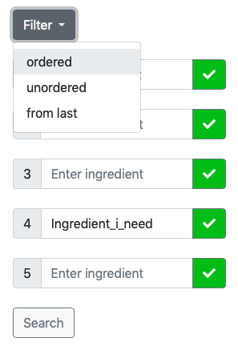
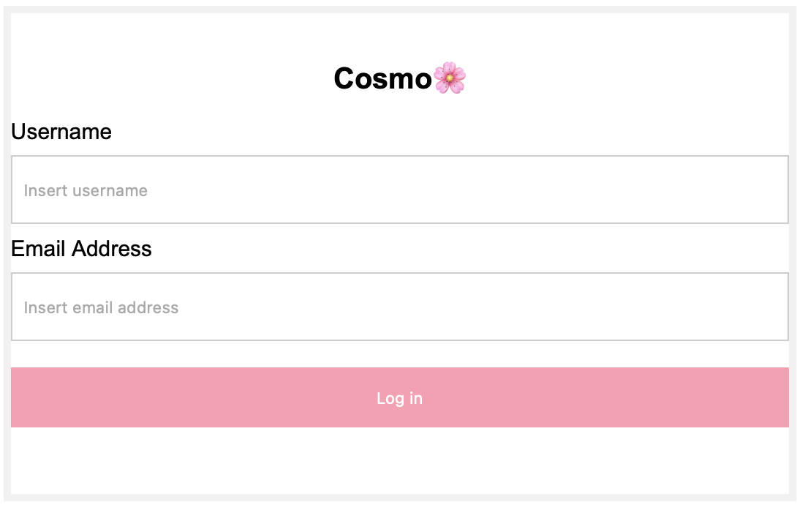

# <center>Project Work Document – Group 2 <br><small>Cosmo – Cosmetics Search engine by Ingredients</small></center>

<!-- Below is a draft structure for your project document submission. Sections in bold font are compulsory, however you may adjust any sub-sections (remove or add) as required to make it tailored to your own work.
This document would be used to assess your project work and understand your approach to the project delivery. It will also provide an insight into your architecture, testing and implementation strategy as a team.

NOTE: Your instructors team would also use this documents as part of the mock interview assessments to support their enquiries about your work and ‘rehearse’ live-like interview scenarios.
We expect this report to be concise, but very detailed, so that every key point is explained and covered. It should be no more than 5-7 pages (A4) long. The report can and should include diagrams, images with descriptive captions.-->

## INTRODUCTION
### Aims and objectives of the project
Our project aimed at building a cosmetic search engine by ingredient: Cosmo.  
Our objectives were to allow users to: 
- sign up, create an account and log in to it (Users side) <!--arm/wing-->
- search for products meeting several ingredient-related criteria (Products side)
- save selected products to their wishlist and manage it as they want (Wishlist side)

### Roadmap of the report
xxxxxxxxxxxxxxxxxxxxxxxxxxx


## BACKGROUND
<!--Any specific details about the project based on your chosen topic. For example, if it is a game, it would be good to understand the rules of the game and its logic. If it is a trading portfolio, then explain what analysis you are performing (end of day profit/loss, historical price evaluation etc.) and how does it work. If it is a restaurant booking system, then explain the rules / requirements that your team locked in for the system.-->

Imagine looking for a replacement to your favourite conditioner which has been discontinued, a cheaper equivalent to some expensive skincare product, one excluding some ingredients to which you are allergic, or substituting them by more ethical alternatives. How would you go about it?

The world of cosmetics can be difficult to navigate: marketing often presents products as some sort of magic potions wrapped in a pretty packaging, using fancy buzzwords and making inaccurate and/or unrealistic claims about their benefits.  

In reality, cosmetics are formulas composed of specific molecules with a particular biological effect, and even though their exact recipe usually remains a trade secret, the order of ingredients on the label reveals important information, as it reflects their relative concentrations: the first has the highest concentration, the last one the lowest.

In theory, an informed consumer should thus be able to make a choice based on this objective criteria. Given the host of choice we are given on the market, however, this deceptively simple task can prove nigh impossible. One cannot realistically browse the entire web, systematically comb every shop shelf and read every single product label… This is where data comes into play at our rescue.

Some cosmetic-related tools and search engines such as Open Beauty Facts (OBF) or INCIDecoder already exist, but so far they only offer a list of products containing or not a specific ingredient, regardless of their position within the list.

Cosmo is an app that not only returns a list of products containing a particular ingredient, but also takes into account its position in the ingredient list. Moreover, it allows you to search for products without a specific ingredient, and to perform a multi-criteria search up to the 5<sup>th</sup> ingredient.


## SPECIFICATIONS AND DESIGN
### Requirements 
#### Technical requirements 
We used portable tools and languages to build our application, specifically:
- Languages: Python 3.9, SQL, javascript, html and css
- RDBMS: MySQL Workbench and DB Browser for SQLite
- IDEs: PyCharm and VSCode
- Version Control: GitHub.com and IDEs Git tools

#### Non-technical requirements
We aimed at implementing Agile philosophy and make our application user-friendly, fast, practical and reliable.
We also thought about its maintainability by writing documentation in order for our code to be easily understandable by later developers. 

### Design and architecture
Our application comprises the following components, here ordered from back to front end:
- **2 Databases**
  - Products DB
    - Products table
    - Ingredients table
    - Search table
  - Users & Wishlist DB
    - Users table
    - Wishlist table
- **3 DB Utils scripts**
  - For Products
  - For Users (OOP)
  - For Wishlists 
- **API (2-in-1)**
  - Products & Wishlist API
  - Users API
- **Website User Interface (UI)**
  - Home page/ Search Tool
  - Login and Sign up page
  - Results display page
  - Login and Sign up page
  - Wishlist page
  - Account page

  
<div style="text-align: right"> High-level Diagram of the Cosmo application</div>

#### Databases (DB)
Because we originally planned to use the remote Open Beauty Facts products DB through their API and to create our own Cosmo DB containing Users information and their Wishlists, we decided to keep the "Products" and the "Users & Wishlist" DB artificially separated. In reality, this is not absolutely necessary, and we could put them together, but we kept them apart in order to conserve our original design with an external and an internal DB. For this project, they are still run on the same local RDBMS, but ultimately we would like to host them on a remote server . 

  
<div style="text-align: right">Databases EER diagram</div>

##### 1 - Products DB (`cosmo_tables.sql` and `Products` DB)
The `Products` database, also referred to as `OBF DB`, contains cosmetic products related information and is divided into two large `products_table`and `ingredients_table` and a smaller `search_products` tables.

###### Products table (`products_table`)
The product table is a cleaned up version of the database downloaded from [Open Beauty Facts](https://world.openbeautyfacts.org/data/en.openbeautyfacts.org.products.csv). This 18843 rows x 176 columns table was modified by the `clean_csv_tables.py` script using the `pandas` library and a homemade `ListDF.py` module in order to only keep products for which a proper list of ingredients was available. A unique `productID` was created for each row and only 17 columns were selected, resulting in a 7082 rows x 18 columns table. A monotonically increasing `index` field was also added because as the database was being cleaned up, some rows were deleted but the others kept the same `productID` for consistency. *(see EER diagram above)*  

###### Ingredients table (`ingredients_table`)
The `ingredients_text` column from the products table was then parsed, transformed into a list and expanded, so that for each `productID`, every single ingredient would go into a single column according to its index in the list. This step created a new 7082 rows x 119 columns table in which the first field corresponds to the productID, and the others to the index of ingredients within the ingredients list, from `0` to `117`. *(see EER diagram above)*  


###### Search table (`search_table`)
This table temporarily (?) stores the results of individual product searches so that they can be retrieved and displayed on the `Results` web page while doing another search. *(see EER diagram above)*


##### 2 - Users & Wishlist DB (`CFG_Projet`)
Our application is optimised for usability, with the Users & Wishlist DB being designed to save user information, so they can come back to view their previous searches and wishlist. When users create an account, our web pages send the information they inserted into the forms to our DB.

###### Users information table (`Users_Info`)
The Users Info table stores information that has been taken from the user such as their name and email address. This table is connected to the wishlist table through a primary key.
###### Wishlist table (`Wish_List`)
The Wish List DB stores products found through our cosmetic search engine and that the user would like to come back to. The Wish List stores data for a particular user retrieved using the API.

#### DB Utils (+ credentials)
The bulk of the operations listed below is handled by the DB_utils files.
A few of them include but are not limited to:
- Use the user's product ingredient search to query the `Products` DB
- Send the results from this query to be displayed on the `Results` display webpage
- Transfer new wishlist data from the website to the wishlist table in the User Info DB
- Send all the wishlist data from the wishlist table to the website whenever the user wants to view them on the `Wishlist` page

##### 3 - For products (`obf_db_utils.py` + `config.py`)
This file contains functions responsible for querying the `Products` DB according to the user input's search criteria. They work by retrieving the `productIDs` corresponding to products fulfilling these conditions, then fetch the rest of the product information from either the `product_table` table or the `ingredient_table` one, depending on whether the filter search criteria was set on 'unordered' or 'ordered' respectively.  

They allow for the following searching functionalities:
- ingredient simply present in the product ingredient list (fuzzy search)
- ingredient not present in the list
- ingredient present at a specific place in the list (from 1<sup>st</sup> to <sup>5th</sup>)

In addition, a few other functions allow the search results to be processed and presented in a more user-friendly and less resource-intensive way, by:
- returning them in pages
- avoiding to display products containing too many null values
- storing them in the `search_table` table on the `Products` DB and fetching them to be presented on the Results webpage. 

**Functions in this file**  
- `_connect_to_db(db_name)`
- `_map_values(result)`
- `exception_handler(query)`
- `get_productids_containing(ingredient,n=None)`
- `get_productids_ingt_in_nth_position(ingredient, n)`
- `get_products_by_ids(id_list)`
- `format_input(ingredients_input)`
- `get_products(output,search_func1,search_func2)`
- `get_proper_ingredients_list(_dict)`
- `_get_all_product_ids`
- `display_less_null_values`
- `store_results`
- `fetch_results`
- `returning_products_in_pages`


##### 4 - For users (OOP) (`db_utils_user_oop.py` + `config.py`?)
This file contains functions responsible for querying the database and handling db connection errors if they occur. Some of these functions will insert user information into the `User_Info table` and retrieve it whenever the user logs in, and are used depending on the nature of the API request. *(see details in the API section)*  
This particular DB Utils script was written in OOP because user data is more easily conducive to this programming paradigm/model.

**Methods in this file**  
- **`class dbConnection`**  
  - `__init__(self)`
  - `conn(self)`
  - `add_user(self, user_id)`
  - `_get_user(self, user_id)`
  - `update_user(self)`
  - `delete_user(self)`
  - `verify_login(self, user_id, username, name_user, email_address)`
  - `get_user_id(self, username, name, email)`


##### 5 - For wishlists (`wishlist_db_utils.py` + `wishlist_config.py`)
This file contains functions responsible for querying the database and handling database connection errors if they occur. Some of these functions either insert or retrieve wishlist data, and are used depending on the nature of the API request. *(see details in the API section)*

**Functions in this file**  
- `_connect_to_db(db_name)`
- `exception_handler(query, error_message)`
- `exception_handler_wish(query, error_message)`
- `exception_record_exists(query, error_message)`
- `_map_values(result)`
- `add_wish_list([all columns])`
- `_get_wish_list_individual(UserID, ProductID)`
- `_get_wish_list_all(UserID)`
- `delete_wishlist_item(UserID, ProductID)`
- `delete_wishlist(UserID)`
- `update_wish_list([all columns])`

#### API
Our Flask RESTful 2-in-1 API creates routes (http pipeline) for data exchange, offering endpoints to connect to our 2 databases from the website UI with which the user interacts.

##### 6 - Products & Wishlist API (`obf_app.py`)
**Endpoints**  
- `@app.route("/")`  
The function `serve_home_page()` displays the home page when the application starts. 
- `@app.route("/Search", methods=['POST'])`  
The function `find_products()` uses a POST method (and not a simple GET one) to make a
  request from the front end UI containing the `ingredient_input` search formatted as a dictionary, i.e.:  
```python
dict_ = {
    'filter': 'ordered',
    'data': {'1': ['water', True],
             '2': ['glycerin ', False],
             '3': ['alcohol', True],
             '4': ['parfum', True],
             '5': ['', True]
             }
}
```
- `@app.route("/Search", methods=['GET'])`  
The function `return_list()` returns a list containing a list of products dictionaries. `[[{}{}{}{}]]`
- `@app.route("/results", methods=['GET'])`  
The function `get_results()` calls the `fetch_results()`function from `obf_db_utils` which returns a list of product results `[{}{}{}{}]` and returns a jsonified version of it to the frontend.


- `@app.route('/wishlist/add/<int:user_id>/<string:product_id>',methods = ['GET'])`  
The function `add_wish_list_func(user_id,product_id)` uses the `get_products_by_ids([product_id])`function from `obf_db_utils` and the `add_wish_list([all columns])` function from `wishlist_db_utils` to add a product to the wishlist of a specific user.
- `@app.route('/wishlist/<int:user_id>', methods=['GET'])`  
The function `get_wishlist(user_id)`uses the `_get_wish_list_all(user_id)` function from `wishlist_db_utils` to fetch al wishlist products corresponding to a particular user and returns a jsonified list of products dictionaries. `[{}{}{}{}]`

##### 7 - Users & Wishlist API (`user_api.py`)
**Endpoints**  
- `@app.route('/profile/<int:user_id>', methods=['GET'])`  
The function `get_users(user_id)`retrieved the user information as a dictionary: 
`{ "Email_Address": "nik1@mail.com", "Name_User": "nikita", "User_ID": 2, "User_Name": "niki123"}`
- `@app.route('/profile/change/<int:user_id>/<old_user_name>/<new_user_name>')`  
The function `change_user_name(user_id, old_user_name, new_user_name)` uses the `update_user_name` function from `user_db_utils` to update a username using their user ID.
- `@app.route('/profile/change/email/<int:user_id>/<old_user_email>/<new_user_email>')`  
The function `change_user_email(user_id, old_user_email, new_user_email)` uses the `update_user_email` function from `user_db_utils` to update a user email using their user ID.
- `@app.route('/register', methods=['POST'])`  
The function `user_acc()` takes user information as a dictionary to add it to the User_Info table.
- `@app.route('/delete/<int:user_id>')`  
The function `delete_user_(user_id)` uses the `delete_user(user_id)` function from `user_db_utils` to delete a user row using their user ID.
- `@app.route("/login/<string:username>/<string:email>", methods=["GET"])`  
The function `verify_login_api(username, email)` uses the `verify_login(username, email)` function from `user_db_utils` to check whether a user exists for them to login. 
- 

#### Website User Interface (UI)
##### Home page/ Search Tool
  
On the the `Search` page are input fields for up to 5 ingredients.  
- When the button on the right side is toggled on the green ✅ "include" option, Cosmo will search for products containing this specific ingredient and take into account the state of the `Filter` button.  
- When the `Filter` button above the search fields is toggled on `unordered`, the search is done in an unspecified order. Otherwise, if it is on `ordered`, the number on the left of the search field corresponds to the position of the ingredient in the product ingredient list.  
- When the button on the right side is toggled on the red ❌ "exclude" option, Cosmo will search for products **not** containing this specific ingredient at all, that is without taking into account the state of the `Filter` button for this specific ingredient.

##### Login and Sign up page
New users can sign up for an account and existing users can just log into their previously created account at any time.


##### Results display page
This is where user search results will be displayed according to the ingredients they input on the `Home`/`Search` webpage.

##### Login and Sign up page
New users can sign up for an account and old users can just log into their previously created account at any time.

##### Wishlist page
The `Wishlist` feature enables users to save products to which they want to be able to come back from their search results. Product added to their wishlist will be stored on the `Wish_List` table of the Users & Wishlist DB, and displayed on the `Wishlist`webpage. This relies on the creation of an account which would store all products specified by the user. Each wishlist is unique to the user, and stores only the products they have selected from their own search results.

##### Account page
The Account webpage hows the user's personal information, such as their username, email address, etc.


## IMPLEMENTATION AND EXECUTION
### Development approach and team member roles
We tried to give ourselves roles as in a typical Agile team, but as we all had the same experience with this methodology (that is, none), it was not really possible to rely on a senior Agile expert "Scrum Master", and the role of "Product Owner" was also difficult to implement in a self-organising "democratic" team. Therefore, the workload was distributed based on the sections on which team members wanted to work, because they enjoyed this particular part of the project or in order to improve their programming skills. Some focused more on some specific aspects of the project, others worked on more diverse ones. 

|                **TASKS**                |**Chizu**|**Claire**|**Georgia**|**Nasian**|**Nikita**|**Sophie**|
| :-------------------------------------- | :-----: | :------: | :-------: | :------: | :------: | :------: |
| Products DB (Cosmo-OBF)                 |    X    |     X    |           |          |          |     x    |
| Users & Wishlist DB                     |         |          |           |     X    |     X    |          |
| Products DB_Utils & Config              |    X    |     X    |           |          |          |     X    |
| Users DB_Utils & Config                 |         |          |     X     |     X    |     X    |     X    |
| Wishlist DB_Utils & Config              |         |          |           |     X    |     X    |     X    |
| Products API                            |    X    |     X    |           |          |          |     x    |
| Users & Wishlist API                    |         |          |           |          |     X    |     X    |
| Tests                                   |         |          |           |     X    |          |     X    |
| Backend Main (mock Front End for tests) |         |          |           |     X    |          |     X    |
| Front End Web UI                        |    X    |          |     X     |          |          |          |
| Documentation, organisation             |    X    |     X    |           |     x    |          |     x    |
| *Scrum Master*                          |    x    |          |     x     |          |          |          |
| *Product Owner*                         |         |     x    |           |          |          |          |

### Tools and libraries
- `mysql.connector`
- `flask`
- `flask-cors` Cross Origin Resource Sharing (CORS): required for the frontend to send requests
- `json`
- `requests`
- `pandas`
- `math`
- `unittest`
- `unittest.mock`
- `operator`
- `ListDF.py` (homemade module to apply functions on whole dataframe columns)

### Implementation process (achievements, challenges, decision to change something)
Originally, we intended to use the Open Beauty Facts (OBF) DB indirectly by consuming their API, but as it was still very experimental, barely documented, and did not actually work for our purpose since it only offered the possibility to search for products barcodes, we changed our minds and resolved to use the OBF database differently.  
At the beginning, we even considered webscraping it, but it was not practical, and eventually we settled for downloading it as a CSV file. We then cleaned it up to obtain the `products_table` table, which was then used to create the `ingredients_table` table. As some of us ran through codec errors preventing the these files from being normally imported into MySQL Workbench, it was done into DB Browser for SQLite instead. The resulting `Products` database was eventually exported as a SQL file, then imported back into MySQL Workbench and its syntax slightly modified to function on this RDBMS.

### Agile development (did team use any agile elements like iterative approach, refactoring, code reviews)
We strove to follow the Software Development Life Cycle (SDLC) framework and to implement Agile methodology. 
In particular, we had our Scrum Master organise Daily Scrum and weekly Sprint Planning meetings on Zoom. 
 Through our Daily Scrum meeting, we updated each other on what we had been worked on, the problems we encountered and on what we were intending to work next. 
or added to the GitHub, we will check our code works as intended and review it or clean up the code when necessary.

We also created "User Stories" to present features to implement in our product. 
We started by creating a very minimal core app with only a few functions, made sure that they worked, then incrementally improved our app. 

We managed our code with GitHub, and created a branch `X_branch` for each team member to push their modifications on the remote repository for others to see.
Our team was split into task-based subgroups in which members reviewed each other's code.
- Before we push our code to GitHub, we ensure our code is consistent within the sub-groups we’re working in.
- We have longer meetings on Sundays in which we review the work we have done and discuss what we completed within the week and what there is left to complete or do for the week which is coming up. This is also a chance to come together and ensure our code is consistent with each other.

### Implementation challenges
One of the main challenges we had to overcome was actually the coordinated use of GitHub, which could sometimes prove confusing, which led to regular conflicts, failed pulls or pushes ,and even an unexpected "detached head state" at some point. This should improve with time as we get used to handle GitHub on a daily basis.   

A ClickUp workspace was set up for our group to help us organise our tasks, but it proved difficult to get everyone to use it consistently and communicate efficiently with everyone else. This was also probably due to the fact that we had different schedules and could not always be all present together at the same time for meetings.  

Besides, some of us fell sick (and still are!), which meant that others unexpectedly had to take care of their tasks alongside their owns.

On the database side, out plan was initially to run a script (`clean_tables.py`) which would regularly automatically download the OBF CSV Products file from the Open Beauty Facts website, then clean it up, produce the products and ingredients table and created the Products DB from them... But when the certificate of their website expired, we had to find another solution, changed our mind and worked from a downloaded backup CSV file. Maybe this data pipeline would work again now, but in the meantime we moved on. 

The RDBMS MySQL Workbench was also the source of some codec errors apparently linked to the fact that it was not originally meant to run on some operating systems. This problem was work around but never actually solved. 

Another issue that we encountered was linked to out IDEs, with PyCharm or VSCode not being always able to import modules which were properly installed, and here again, no reliable solution was found and the reasons why a specific module was found or not remained unclear. 

Implementing Object Oriented Programming in our app did not come noturally, so we had to refactor our code to transform the Users DB Utils script into OOP, but it eventually worked. 

Other than that, creating the front end in javascript came with its own challenges, as well as using `@patch` to perform mock testing of our app for example, but eventually these issues were overcome.


## TESTING AND EVALUATION
### Testing strategy
We intend to test the system using unit testing for various aspects of our code and system.
Our testing strategy was to create a file where we mocked the UI and mocked input to test our functions, and then we also did unit tests on all our functions in both wishlist db utils and also in our file where we mocked the UI

#### Test Files

- `obf_main.py`
  - **`class MockProductFrontEnd`**
    - `get_every_product(self,order,ingredient1,boolean1,ingredient2,boolean2,ingredient3,boolean3,ingredient4,boolean4,ingredient5,boolean5)`
    - `fetch_existing_search_result(self)`
    - `welcome_message(self)`
    - `selecting_ingredients(self)`
    - `input_products(self)`
    - `results_again(self)`
    - `run()`  


- `obf_tests.py`
  - **`class TestAPIProductFrontEnd(TestCase)`**
    - `setUp(self)`
    - `test_unordered_containing_water(self,mock_inputs)`
    - `test_unordered_containing_glycerin(self,mock_inputs)`
    - `test_unordered_containing_parfum(self, mock_inputs)`
    - `test_unordered_bicarb(self,mock_inputs)`
    - `test_ordered_aqua(self, mock_inputs)`
    - `test_ordered_water(self, mock_inputs)`
    - `test_bad_input(self,mock_inputs)`
    - `test_bad_input_result(self,mock_inputs)`
    - `test_allergic_to_ingredients_aqua(self,mock_inputs)`
    - `test_allergic_to_ingredients(self,mock_inputs)`
    - `test_no_water(self, mock_inputs)`
    - `test_null_values(self,mock_inputs)`
    - `test_null_values_order(self,mock_inputs)`
    - `test_result_save(self,mock_inputs)`
  - **`class TestDBUtils(TestCase)`**
    - `test_empty_input_list(self)`
    - `test_one_search_id(self)`


TEST CASES `obf_tests.py`:
- Ordered ingredients input
- Unordered ingredients input
- Input that returns no results
- Input with only ingredients not wanted
- Tests no null values in output
- Tests product dictionaries with more null values appear at bottom of results
- Tests retrieving most recent search result brings back exact same result
- Tests exception handling in obf db utils


- `user_main.py`
  - **`class MockFrontEnd`**
    - `__init__(self)`
    - `get_profile_by_id(self,user_id)`
    - `add_new_user(self,user_name,name,email)`
    - `delete_user_func(self,user_id)`
    - `user_login(self,user_name,email)`
    - `welcome_message(self)`
    - `enter_details(self)`
    - `verify_account_added(self)`
    - `displaying_user(self)`
    - `deleting_account(self)`
    - `run()`


- `user_tests.py`
  - **`class TestApiDb(TestCase)`**
    - `setUp(self)`
    - `test_add_new_user(self)`
    - `test_add_new_user_2(self)`
    - `test_get_fang_profile(self)`
    - `test_add_new_user_has_been_added(self)`
    - `test_deleting_user(self)`
    - `test_user_login(self)`
    - `test_user_login_false(self)`
    - `test_delete_non_existing_user(self)`
  - **`TestMockFrontEnd(TestCase)`**
    - `test_positive_input(self, mock_input)`
    - `test_negative_input(self, mock_input)`
    - `test_wrong_input(self, mock_inputs)`
    - `test_incorrect_email(self, mock_inputs)`
    - `test_incorrect_email_2(self, mock_inputs)`
    - `test_adding_user(self,mock_inputs)`
  - **`class TestRunFunction(TestCase)`**
    - `test_incorrect_email_3(self,mock_inputs)`
    - `test_creating_user(self,mock_inputs)`
    - `test_deleting_user(self,mock_inputs)`
    - `test_creating_user2_ayesha(self,mock_inputs)`
    - `test_creating_user_zita(self,mock_inputs)`
    - `test_goodbye(self,mock_input)`
  - **`TestUsersDelete(TestCase)`**
    - `setUp(self)`
    - `test_delete_zita_user(self)`
    - `test_delete_fang_user(self)`
    - `test_delete_sophie_user(self)`
    - `test_delete_ayesha_user(self)`
    - `test_delete_unknown_id(self)`


- `wishlist_main.py`
  - **`class MockFrontEnd`**
    - `__init__(self, db_name)`
    - `def add_new_wishlist(self)`
    - `_get_wish_list_individual(self, User_ID, productID)`
    - `_get_wish_list_all(self, User_ID)`
    - `delete_wishlist_item(self, User_ID, productID)`
    - `delete_wishlist(self, User_ID)`
    - `welcome_message(self)`
    - `verify_wish_list_item(self)`
    - `verify_wish_list(self)`
    - `deleting_wishlist_item(self)`
    - `deleting_wishlist(self)`
    - `run()`


- `wishlist_tests.py`
  - `class TestWishListApiDb(unittest.TestCase)`
    - `test_1_add_wish_list(self)`
    - `test_2_get_wish_list_item_if_not_exists(self)`
    - `test_3_get_wish_list_all_if_not_exists(self)`
    - `test_4_delete_wish_list_item_if_not_exists(self)`
    - `test_5_delete_wish_list_all_if_not_exists(self)`
    - `test_6_get_wish_list_item_if_exists(self)`
    - `test_7_get_wish_list_all_if_exists(self)`
  - `class TestMockFrontEnd(unittest.TestCase)`
    - `setUp(self)`
    - `test_8_add_new_wishlist(self)`
    - `test_9_verify_wish_list_item(self, mock_inputs)`
    - `test_10_verify_wish_list(self, mock_inputs)`
    - `test_11_add_new_wishlist_mocked_values(self, mock_wish_list_dict)`
  - `class TestMockFrontEndDelete(unittest.TestCase)`
    - `setUp(self)`
    - `test_12_delete_wish_list_item(self, mock_inputs)`
    - `test_13_delete_wish_list_all(self, mock_inputs)`
  - `class ReAddingData(unittest.TestCase)`
    - `test_14_re_add_mock_wish_list(self)`
    - `test_15_re_add_wish_list_1(self)`
    - `test_16_re_add_wish_list_2(self)`
  - `class TestWishListApiDbDeletingUsers(unittest.TestCase)`
    - `test_17_delete_wish_list_item(self)`
    - `test_18_re_add_wish_list(self)`
    - `test_19_delete_wish_list_all(self)`
    - `test_20_re_add_wish_list_1(self)`
    - `test_21_re_add_wish_list_2(self)`

### Functional and user testing
we want to test:
- The creation of a new user account in which the user will input their name, email and password - to make sure this information is both updated to the sql database and actually creates an account for the user to login to.
- We want to test our data and ensure we can get information associated with a specific user through their user ID/ name - one way would be to have a Test case ID to ensure all users have a unique ID to represent them
- We want to test the searching facility to make sure ingredients are found in the correct order.
- We also expect to test the ability of our system to retrieve and display items with a specific ingredient defined by the user.
- We want to test the wishlist feature to make sure all items on the wish-list are displayed qon the wishlist page, with a dictionary containing product information. This test would also need to show that the items a user saves in their wishlist basket is also updated to a SQL database so that the user is able to retrieve their saved wishlist items at a later date.

### System limitations
Because the OBF database on which we relied was not perfectly clean, and its data entry having not always beeen done in a consistent manner, it is still a bit difficult go retrieve clean search results. For example, the `ìngredients_text` column of the original OBF CSV table contained ingredients which were not always separated by commas, and sometimes contained a lot of other completely irrelevant information such as usage instructions or company addresses for example. We tried to clean up the data, but there was a lot of it, it is still not completely done.  

Also at this stage we are still relying on the user installing our databases on their system, which is not realistic in the real world. Therefore, one of the first things that we would improve being given more time would be to host these DB on a remote server so that Cosmo would be made available from anywhere on the Internet and behave as a normal web application.  

Besides, some functionalities that we had initially planned to implement in the Cosmo app are still not in the first version of the finished working product, but we would like to add them as soon as possible. For example, we need a function to search products in reverse order (button `Filter`toggled on `from last on the `Search` page).  

Finally, there are features that we would like to add later but that we could implement during this nanodegree.
For example, we would like Cosmo to act as a one-stop shop by giving links to online shops selling a product. We would also enable users to avoid or favour products made or sold in a particular country, or search only for vegan products for example. All of this information does exist in the OBF DB but we have not taken advantage of it yet. 
Another interesting but more complex option could be to find products having the closest composition to another one, which would require calculating similarity scores between products (NLP cosine similarity?).

## CONCLUSION

Creating a web app such as Cosmo as a team proved a very enriching, teaching and rewarding project, although challenging on a technical and interpersonal/organisational level at times. Our product is still a prototype and could certainly be improved, but it fulfils our basic requirements, and other features could now be incrementally added to it. 
